# Anti-Cheat Enforcement System (ACES)

## Summary

ACES is a web application designed to manage software-based assignments for instructors while providing guards against various forms of cheating. The application is built using [ASP.NET Core MVC](https://docs.microsoft.com/en-us/aspnet/core/tutorials/first-mvc-app/start-mvc?view=aspnetcore-3.1&tabs=visual-studio
) and [Microsoft SQL Server](https://www.microsoft.com/en-us/sql-server/sql-server-2019). Its AntiCheat database is currently hosted on WSU Titan server.

The current functionality allows ACES to utilize **RESTful API calls** to:
- download assignment files from the instructor's GitHub repository before watermarking
- watermark the assignment files for each student with anti-cheating watermark options such as random strings and white spaces
- commit the watermarked files to the student's GitHub repository
- download student's GitHub commits data and compare it against expected outcome to detect potential cheating instances

### The demo of the web application functionality is provided at the following [YouTube link](https://youtu.be/PE8wAIxhHzA).

## Getting Started

#### These instructions will help you set the project up and running on your local machine for development and testing purposes.

To authorize API calls, the **anticheatbot** GitHub account was created with a personal access token that is stored in the **appsettings.json** file.

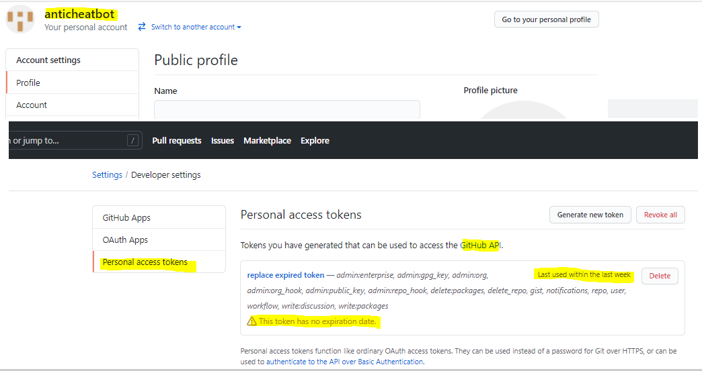

### Step 1: Install Necessary Software
- Install Visual Studio
- Install SQL Server Management Studio

### Step 2: Clone the Repository from GitHub
- Clone the bradleypeterson/ACES2 repository from GitHub

### Step 3: Set appsettings.json file
- After you clone the bradleypeterson/ACES2 repository, the **appsettings.json** file will need to be added on your local machine to the project's folder at the location shown below.

### appsettings.json template
{
  "Logging": {
    "LogLevel": {
      "Default": "Information",
      "Microsoft": "Warning",
      "Microsoft.Hosting.Lifetime": "Information"
    }
  },
  "AllowedHosts": "*",
  "ConnectionStrings": {
    "ACESContext": "Data Source=titan.cs.weber.edu,10433;Initial Catalog=BradHasIt;User ID=BradHasIt;Password=BradHasIt"
  },
  "GithubToken": "BradHasIt"
}

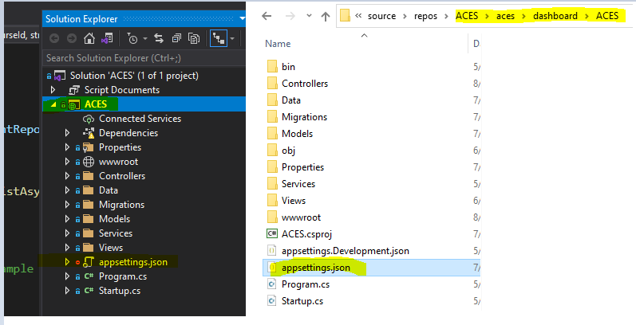

Change the values currently marked as **BradHasIt** in the template. Brad will provide database credentials and GitHub token to replace **BradHasIt** values. The credentials should not be stored on GitHub for security purposes so that unauthorized users do not have access to the database or the token for API calls.

### Step 4: Connect to Titan's AntiCheat database 
If needed, use database credentials from appsettings.json file to connect to the Titan's AntiCheat database in SQL Server Management Studio. For the database schema, relationships chart, database backup script and database README files visit [Database folder](aces/database/).

### Step 5: Start IIS Express
Once you update all credentials, you can start **IIS Express** to run the project locally. When the dashboard opens in the browser, you can either log in as an existing instructor (bradleypeterson@weber.edu mypass111) for testing and debugging purposes or set up a new profile. The existing user credentials should be deleted from the database before going live. 

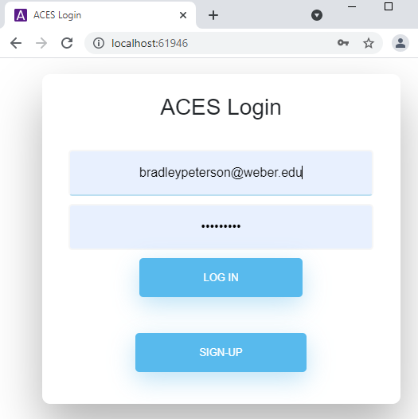

If you select to set up a new instructor, you can follow the instructions below.

## Initial Setup for Instructors to use GitHub Classroom with ACES

### GitHub Setup: 

To utilize ACES functionality for a semester course, the instructor should first set up a GitHub Classroom. The **anticheatbot** account that was created for ACES must be invited to the instructor's GitHub organization and the new classroom on the TAs and Admins tab at the beginning of the semester so that the classroom's assignments can be managed on ACES.

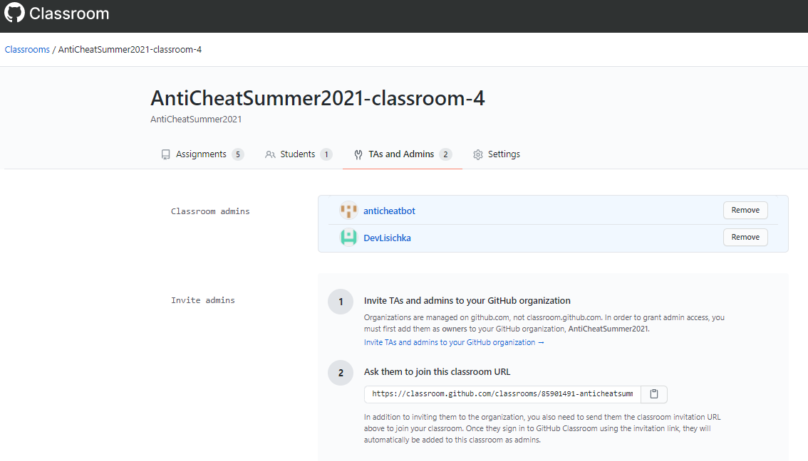

Once the Classroom is set up, the instructor should add the assignment to it. It should be added without selecting a repository, so the initial assignment is empty. 

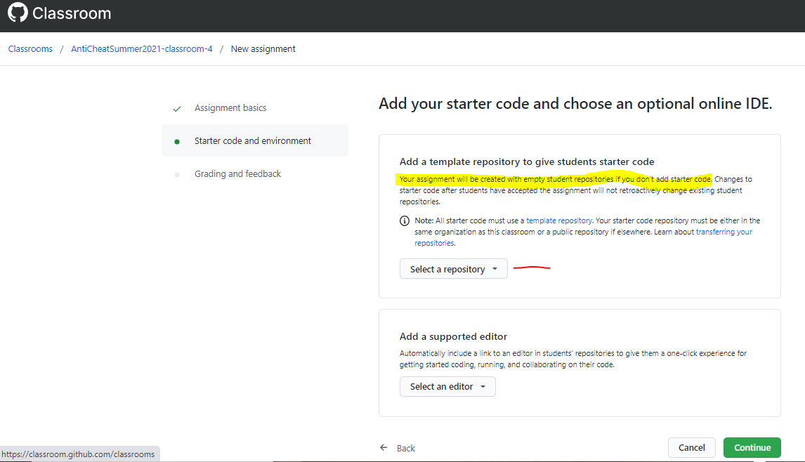

The instructor should copy the invitation link so it can be added to **WSU Canvas**. 

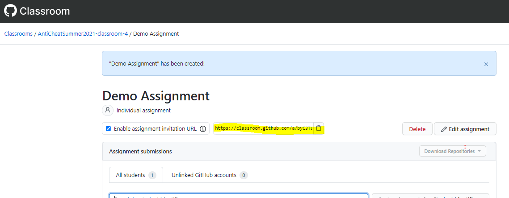

Separately, the instructor should create a GitHub repository with the actual assignment files. This repository URL will be added to ACES so the files from it can be downloaded and customized for each student.

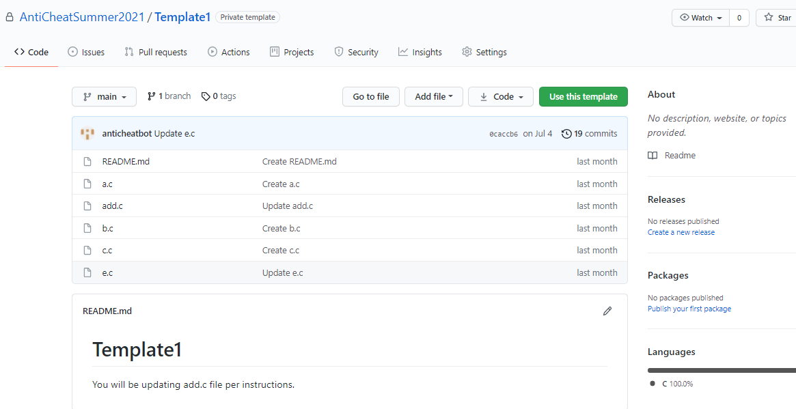

### ACES Setup

The instructor should create a profile on ACES as a professor

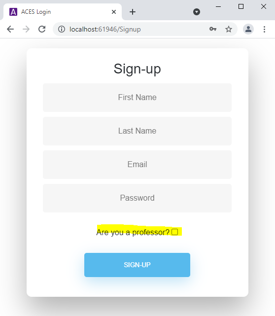

Once registered, the instructor creates a new course on ACES

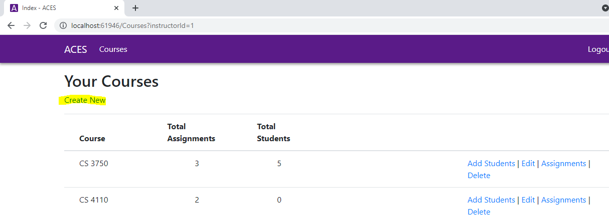

The new assignment is added to the course

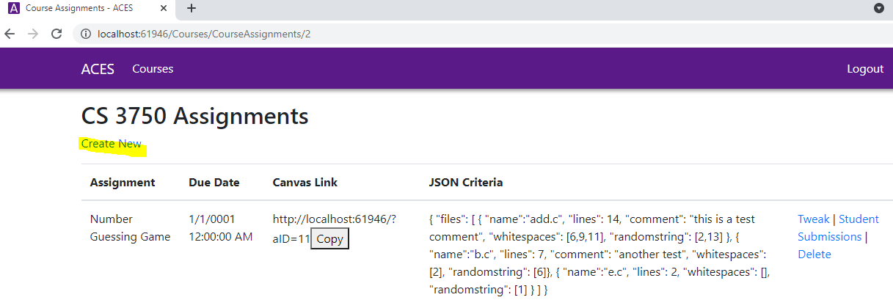

The URL for the GitHub repository with the assignment files must be added to the RepositoryURL field

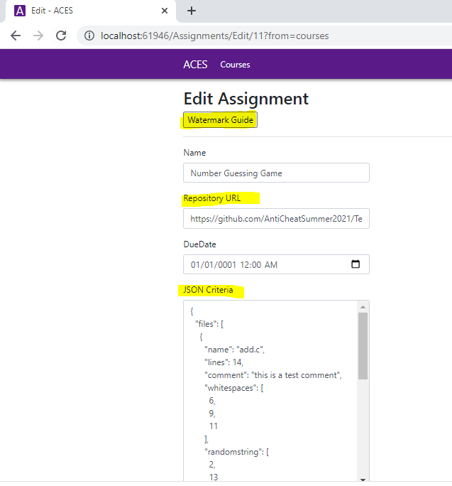

The JSON Criteria field is for the instructor to specify how the files should be watermarked. Clicking on the Watermark Guide button will provide additional details

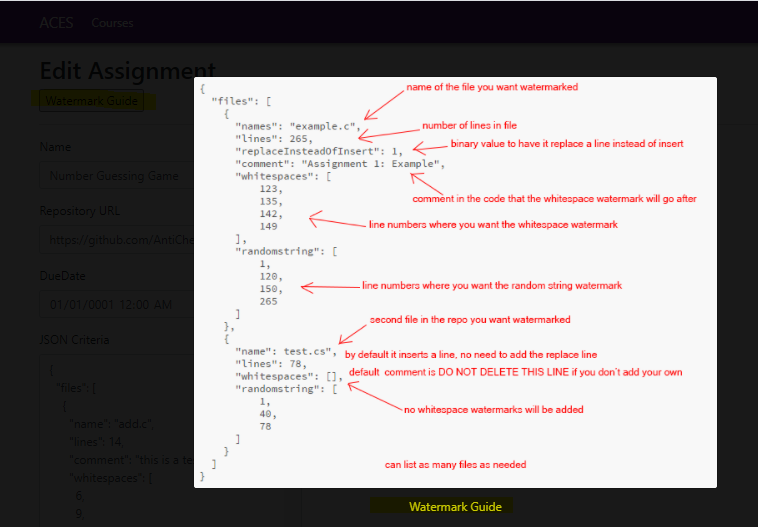

 Once the assignment is created, copy the ACES assignment URL to provide it for students on **WSU Canvas**.
 
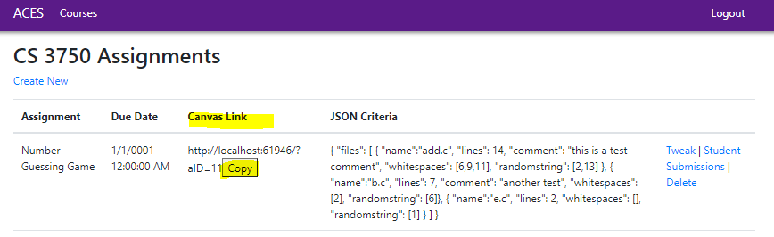
 

### WSU Canvas Setup

The instructor should provide the invitation link for the GitHub assignment and the ACES assignment URL to the course students on Canvas. Once they accept the GitHub invitation, an empty student's repository is created. The student will enter this empty repository URL into ACES once they click on the ACES assignment URL. If the student is not registered on ACES yet, they will sign up first.

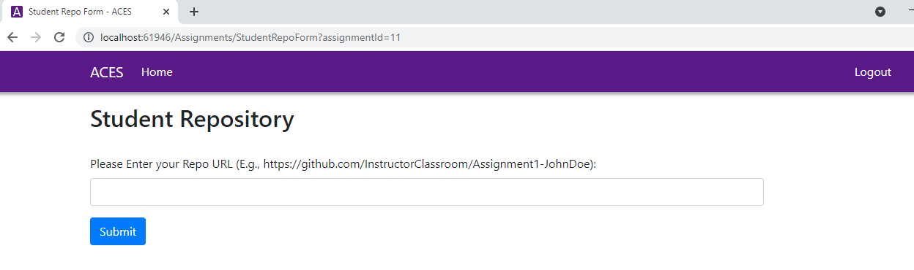

After the student clicks Submit, ACES will get the assignment files from the instructor's repository and watermark the files in accordance with JSON Criteria provided by the instructor. It will then commit all the files to the student's repository so the student can start working on the assignment (StudentAssignments method in StudentInterfacecontroller.cs). If the student is not linked to the course on ACES yet, clicking Submit will also link them automatically to this course.

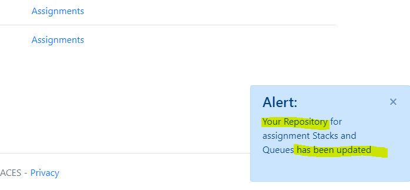

### Updating the student's existing repository

If the student needs to refresh the repository by deleting all its current files and re-adding the files from the instructor's repository (i.e., the instructor changes the assignment files), the student will go back to ACES assignment and re-enter their repository URL

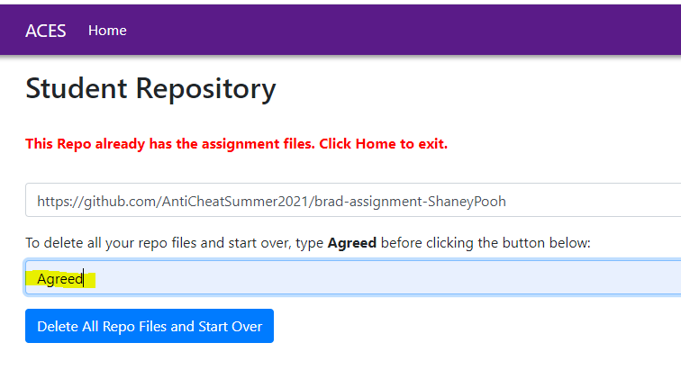

### Files Comparison

When the students submitted their assignment, the instructor will go to Students Submissions (i.e. after the assignment due date has passed)

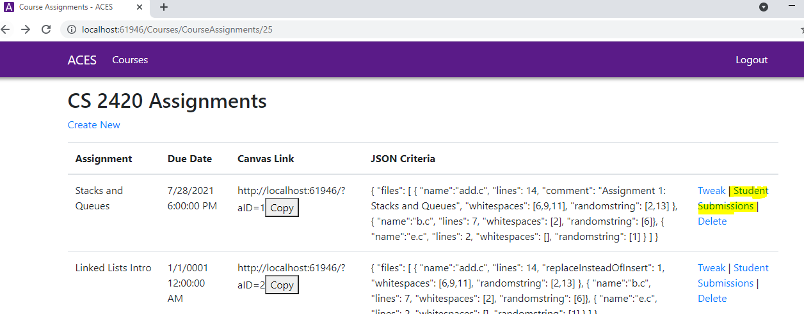

and click on Compare, then View

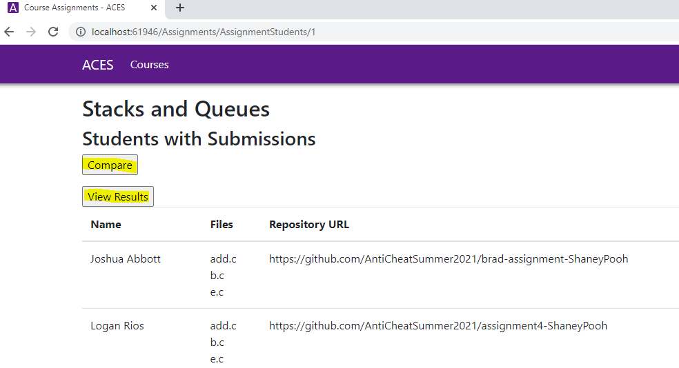

to see the comparison results

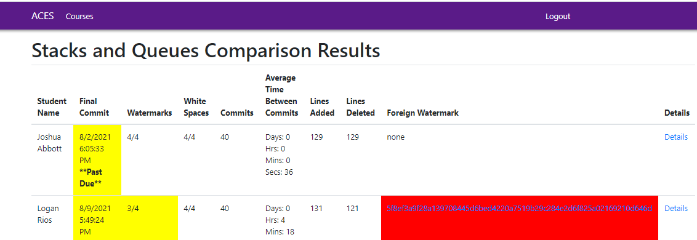

Clicking on Details will show the analysis of the student repository's commits

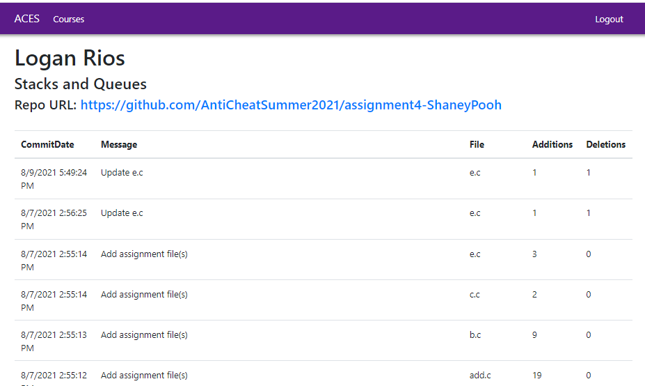

If one of the watermarks does not match the expected outcome, clicking on the watermark will lead to the discrepancy details

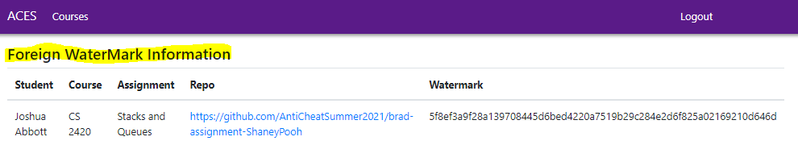

specifying if there is a watermark match with another student's assignment.

The examples are shown in the demo listed at the beginning of this README file.

**Note about ACES version changes**: The original design (Version 1 Summer 2020) included use of Docker. The second version removed the Docker option as it requires an upgrade to Windows Professional or Enterprise, and most of the students on the team did not have the upgraded Windows version. The first version also used a separate python solution for the Factory container that is responsible for watermarking files. The second version combined this functionality under the same ACES solution converting Factory's python part into C#. By implementing the API call from StudentInterfaceController.cs to the FactoryController.cs the second version preserves the option to call FactoryController.cs in the future directly if desired. The option for ACES to work with GitHub Classroom was implemented per the client's preference to allow instructors to use existing Classroom features.

For the chart of the more detailed ACES process flow, go to [Process Flow UML](Images/ACESProcessFlow.pdf)

## Authors

### Version 1 - original (bradleypeterson/ACES) Capstone Project Summer 2020:
* @Aoshua
* @TannerL
* @Morgan-Jensen
* @loganrios

### Version 2 - current (bradleypeterson/ACES2) Capstone Project Summer 2021:
* @EricPeterson4665
* @DylanThomasWSU
* @jessetaylor2
* @TuckerGarner
* @DevLisichka

### Business Requirements Implemented: 

### Tier 1
Tier 1 covers the core functions such as ACES watermarking the code and interacting with Github (pulling original code and committing watermarked code). Instructors will be able to get information about the student's code, such as, remaining watermark count and watermark comparison, last github commit date, etc.

#### ACES can:
- pull source code from Instructor’s repo
- customize student’s files by implementing JSON column instructions, such as adding watermarks, white spaces
- commit watermarked code to Student’s repo
- Provide confirmation message based on the Github response and direct student to their assignment repo if successful

#### Instructor can:
- create account/login to ACES
- create courses for students to join, e.g. CS 2420
- create assignments
 view remaining watermarks of students committed code
- customize watermarking using JSON
- press button to get the report on student’s assignment anti-cheating evaluation (watermarks and last commit date)

#### Student can:
- create account/login to ACES
- join courses, e.g. CS 2420
- update their repos with watermarked files
