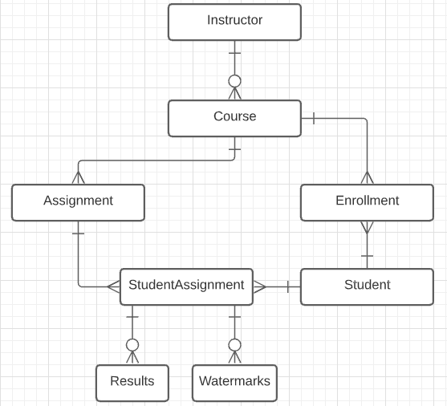

# ACES Database

## Schema

**Assignment:**

	Id : int (PK)
	Name : nvarchar(100)
	RepositoryUrl : nvarchar(MAX)
	JSONCode : nvarchar(MAX)
	CourseId : int (FK)
	CanvasLink : nvarchar(MAX)
	DueDate : datetime

**Course:**

	Id : int (PK)
	CourseName : nvarchar(MAX)
	InstructorId : int (FK)
	IsCourseActive : bit
	

**Enrollment:**

	Id : int (PK)
	StudentId : int (FK)
	CourseId : int (FK)
	
	
**Instructor:**

	Id : int 
	FirstName : nvarchar(MAX)
	LastName : nvarchar(MAX)
	Email : nvarchar(MAX)
	Password : nvarchar(MAX)
	Salt : nvarchar(MAX)
	IsLoggedIn : bit
	
	
**Results:**

	Id : int (PK)
	StudentAssignmentId : int (FK)
	DateCommitted : datetime
	JSONCode : nvarchar(MAX)
	

**Student:**

	Id : int (PK)
	FirstName : nvarchar(MAX)
	LastName : nvarchar(MAX)
	Email : nvarchar(MAX)
	Password : nvarchar(MAX)
	Salt : nvarchar(MAX)
	IsLoggedIn : bit
	

**StudentAssignment:**

	Id : int (PK)
	StudentId : int (FK)
	AssignmentId : int (FK)
	RepositoryUrl : nvarchar(MAX)
	JSONCode : nvarchar(MAX)
		
		
**Watermarks:**

	Id : int (PK)
	Watermark : nvarchar(255)
	StudentId : int (FK)
	AssignmentId : int (FK)
	FileName : nvarchar(255)
	StudentRepoName : nvarchar(255)
	

